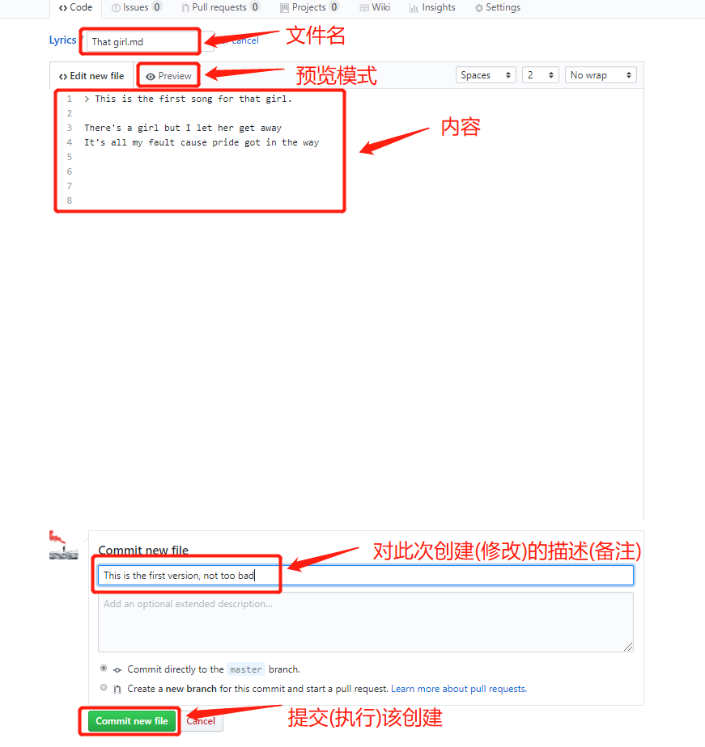
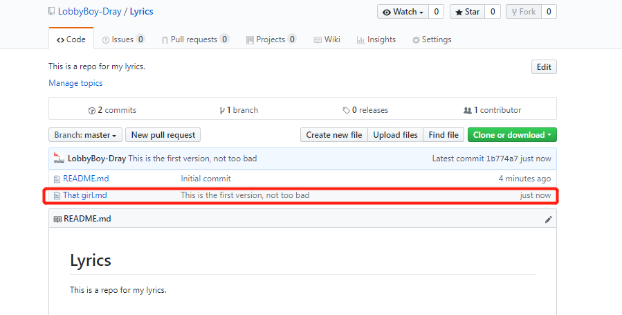
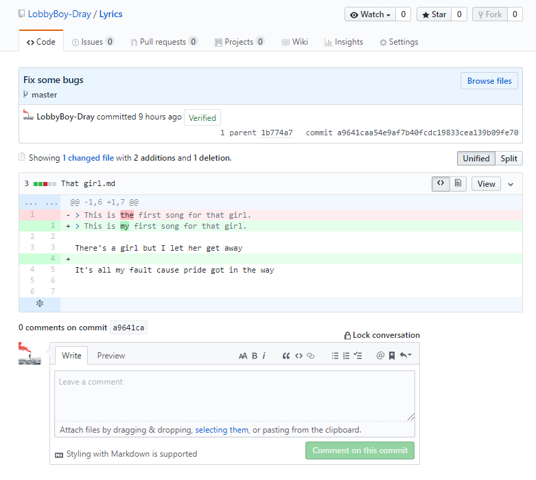
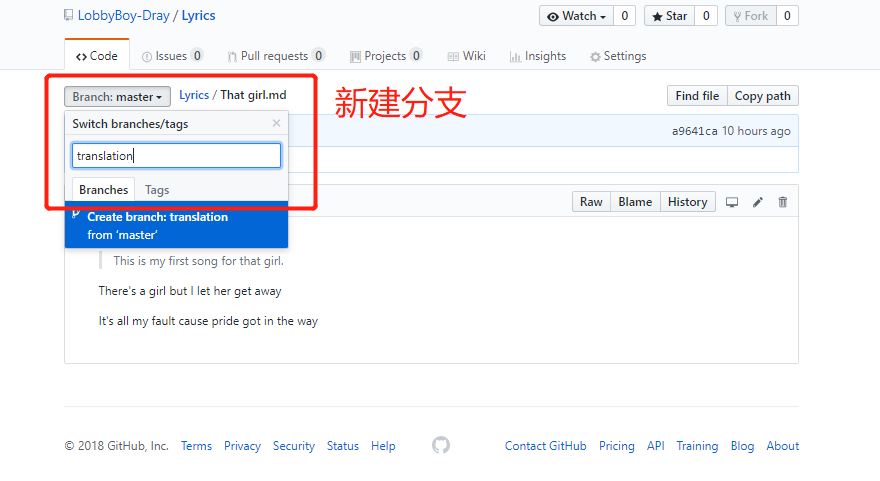
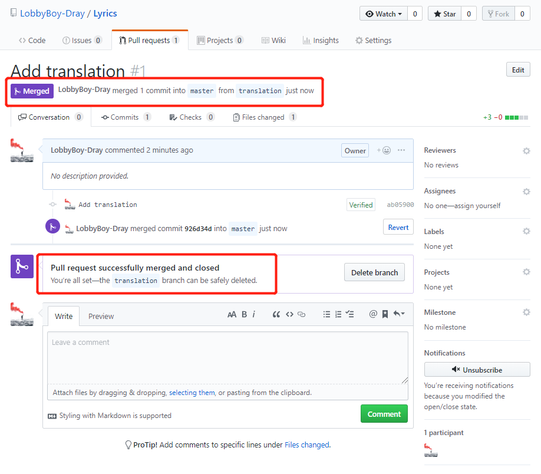

## 1. Git & Github

Git与Github是两个不同的概念。

### 1) Git

Git is one of the most popular **version control system(VCS)**. It is a mature, actively maintained, open source project compatible with many operating systems and IDEs.

Git 是一款免费的、开源的分布式**版本控制系统**。

**什么是版本控制？**

简单来说，版本控制是指，将每次对项目的修改，包括修改内容、修改者、修改时间等内容储存起来，以便track或roll back。

### 2) Github

Github是基于Git版本控制的代码托管平台。即，Github上上传的所有项目代码均是基于Git进行版本控制的。但Github的功能除了Git为它提供的版本控制外，还有其他许多强大的功能，比如项目协作等。

### 3) 两者关系

Github使用Git进行版本控制，同时提供其他强大功能。

“大概就是「魔兽争霸」与「对战平台」的关系吧”——某知乎网友。

## 2. Repository

**Repository**, or "**Repo**"：可以简单理解为**Project**，存储着一个项目，可以包含很多文件，即Repository of files；如果想在Github上拥有一个项目，就必须创建一个Repository。

### 1) Create a repo

在加号的下拉菜单中点击`New repository`：

进入创建repo的界面：

创建成功后自动跳转到该repo内部：

可以在github中创建文件或上传文件：

### 2) Create a new file in github

点击`Create new file`，进入文本编辑界面，输入内容即可（注意文件名要加后缀）。完成后，点击`commit new file`

创建完毕：

### 3) Modify a file in github

点击文件，再点击“笔”，进入修改模式：

修改完成，点击commit changes：

修改历史（历史版本）可以在`History`中查看：

每次修改记录均可见：

点击进入可以查看更加详细的修改信息：

### 3) Upload a new file in github

从本地上传文件至github：

## 3. Branches

分支。主要用于项目的团队开发，也可以用于个人work on different aspects of the project。

任何一个Repo都有一个主分支，名为“master”。You can think the history of a project as a linear list of commit，而这个linear list就是master，如下图所示：

即分支是一个流程，是由无数次的修改提交（commit）构成一个时间轴。

而当你想在Repo中为你的项目加入一些新特性，而又isn‘t sure whether you should keep it的时候，你需要一块专门的空间来做experimental try，在这个空间里，你做的任何改动不会影响“大局”，即“master”，你可以放心对文件进行修改，直到修改到满意为止。这个空间就是你新建的分支（branch），可以最终通过merge，将该分支合并到master上，相当于把原来在“试验田”中的新特性正式加到你的项目中。

对于单人开发，可能只需要master和develop两个分支，平时的开发在develop分支进行，开发测试完成后，在发布前将develop合并到master分支即可。

对于团队开发，可以为每个开发者创建一个分支，每个人在自己的分支上开发自己的部分，然后逐步merge到master。

因此分支相当于生产零部件，master相当于主车间里的主体，最终零部件都是要进入主车间进行装配的。

### 1) 创建分支

举例：现在我想为我的歌词加入中文翻译，因此我可以创建一个分支，名为translation：

创建完毕后：

已经进入translation分支，下面在该分支里对文件进行修改并提交：

点击`Branch`可以切换回master分支：

可以看到在master分支中，中文翻译并没有被加入：

### 2) 合并分支

新建的分支可以在Repo主页面看到：

上图中的绿框`Compare & pull request`就好像这个分支的创建者（这里是我自己）对我说：would you please take my changes? would you please pull my request and merge into the master branch?

所以pull request的含义是：take some changes from the particular branch and bring them into another branch（usually master branch）。

如果想要将该分支合并，点击该绿框，进入pull request页面：

点击`create pull request`。但此时还没有完成merge，点击后github会检测两个合并的分支是否存在冲突，若不存在冲突，继续点击`merge pull request`、`confirm merge`：

合并完成，translation分支可以被删除了：

在`Insights`-`network`里可以看到这一过程的图示：

## 4. Fork

相当于复刻，将别人的Repo完完整整地复刻到自己的Github中，供自己参考，或者在别人的项目基础上进行改进。此时任你如何修改这个fork过来的repo，丝毫不会影响原作者那边的Repo，因为这个Repo相当于副本，也可以理解为使一个branch，在branch上改，当然不影响其他的branch。

**怎样fork别人的Repo？**

进入该Repo，随便点击一个文件，点击“笔”：

或者点击右上角的fork：

## 5. Pull Request

在Branches部分已经简单提及Pull Request的概念，可以理解为“获取请求”。假设别人fork了你的Repo，然后在这个fork上面做了一些改进，他觉得改进很棒，也有利于你的代码，因此他想把他在你的fork上的修改提供给你——contribute it back to the original repo。此时他需要push request，即“推出请求”，即向你发出请求，请求你允许他将他的那部分代码合并到你的原Repo中；而你如果同意的话，就需要pull request，即“获取请求”。

当修改完毕fork的Repo后，

点击后并按操作继续，可以向原Repo的主人push request，接着你就只需默默祈祷他能够pull your request。

在原主人那里，他会接收到你push的request，在下图的`Pull requests`里可以看到，他会根据他的需求选择是否接受你的修改。

## 6. Issue

问题，事件。

Issues  is a place to leave a comment about the project. It can be some one who finds a bug, or you would like to start a vote.

点击`New issue`创建一个issue：

创建完毕后，在issues界面可以看到有一个issue是open的：

点进去后可以关闭这个issue。对于别人发起的issue，你看到了这些问题可以去逐个修复，修复完成后就可以一个个的close掉。

## 7. git与使用命令行

## 8. Clone